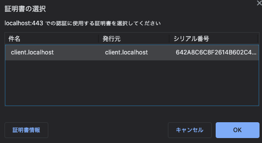

.. post:: 2021-02-11
   :tags: TLS, X.509
   :category: Cryptography

.. meta::
  :description: 自己署名証明書で https サーバを立てる機会があり、昔やったことあるのにまるで覚えてないのにショックを受けたのでこれを機にちゃんと学ぶことにしました。

=======================================================
SSL/TLS サーバ・クライアント認証の基礎
=======================================================

自己署名証明書で https サーバを立てる機会があり、以前やったことあるのにまるで覚えてない事にショックを受けたのでこれを機にちゃんと学ぶことにしました。

はじめに
============

この文章は TLS のサーバ認証・クライアント認証をある程度ちゃんと学んだ上で https サーバを構築してみようという趣旨で書かれています。以下の内容を扱います。

* TLS 関連の基礎知識

  * サーバ認証 / クライアント認証
  * X.509証明書
  * 認証パス
  * 認証局
  * etc..

* openssl を使った証明書生成と検証
* nginx を使ったサーバの構成と Chrome, curl での疎通方法

基本的には理解を深めることを目的としているため、実運用で使える構成例みたいなのは扱いません。

.. tip::

  歴史的な経緯で SSL/TLS という呼称が使われますが、SSL はもう基本的に使わないので最新の TLS Version 1.3 ( `RFC 8446 <https://tools.ietf.org/html/rfc8446>`_ ) に沿って説明します。設定やコマンドなどで ssl という単語が使われる事がありますが、歴史的経緯だと思ってください。

基礎知識
===============================

TLS サーバ / クライアント認証
-----------------------------------

TLS で暗号通信を行うためにはまず TLS ハンドシェイクを行います。TLS ハンドシェイクでは通常サーバの認証が必須になりますが、接続するユーザに制限を加えたい場合にクライアントの認証を要求する場合もあります [1]_ 。サーバにしろクライアントにしろ認証には通常 X.509 証明書 を利用します。

TLS v1.3 ではハンドシェイクの中で、サーバ・クライアントどちらも ``Certificate``, ``CertificateVerify`` メッセージで認証を行います。 ``Certificate`` で X.509 証明書で構成される認証パスを相手に伝え、相手は個々の証明書の失効状態も含めた検証を行い、受諾できるかどうかを判定します。 ``CertificateVerify`` は 秘密鍵で署名付きのデータを生成し相手に送信することで、そのエンドエンティティであることを認証します。

↑の各用語について順にそれぞれ解説していきます。

X.509 証明書とは
-------------------

X.509 証明書 は `RFC 5280 <https://tools.ietf.org/html/rfc5280>`_ で規定されているデジタル文書であり、中心となる要素として以下が挙げられます。

.. list-table::
  :widths: 30, 70

  - - Issuer
    - 発行者。証明書を発行した実体(Entity)
  - - Subject
    - 主体。証明を受ける実体
  - - Public Key
    - 公開鍵 (Subject が所有する秘密鍵とペアになるもの)
  - - Signature
    - Issuer による、その証明書の署名

これらの要素を用いて証明書の内容を文章で表すと「公開鍵xxx とそのペアとなる秘密鍵をサブジェクトxxx が所有していることを発行者xxx が保証します」というものになると言えます。これにどういう意味があるかというと、ある証明書が正しい（信頼できる）ならば、任意の署名がそのサブジェクトによって作成されたかどうかを(証明書に含まれる公開鍵を利用することで)検証できるようになります。正しい署名を作成できるのはサブジェクトだけなので、署名の検証により認証が可能になります。

ではどうやって「証明書が信頼できるか」を判断するのかという話になりますが、そこで認証パスが使われます。

認証パス (Certification Path)
---------------------------------

上述したように証明書には発行者の署名が入っているため、発行者の公開鍵で署名を検証する事により証明書が本物かを確認できます。発行者の公開鍵も証明書によって提供されるため、複数の証明書による信頼の連鎖(Chain of Trust)が構成されます。信頼に値する(Trust Anchor の)証明書から対象の証明書に至るまで全て検証することで初めて対象の認証ができる事になります。

.. warning::

  基本的な考え方としては↑でよいと思いますが、実際は証明書の有効期限や失効の他、証明書に設定された制約に引っかかってないかなども含めた検証が行われるため、もう少し複雑です。詳しい説明は RFC5280 の `6. Certification Path Validation <https://tools.ietf.org/html/rfc5280#section-6>`_ を参照してください。

ちなみに RFC 5280 では概ね 「certification path」と表記されていますが RFC 8446 内では 「certfication path」「certificate chain」両方の表記がされます。この文章は単純に RFC5280 を先に読んでたので 認証パス という表記で統一していますが、証明書チェーンでも意味は同じです。 [2]_

認証局(CA)
-----------------------------------------

証明書の発行や問題のある証明書の失効を行う管理者を 認証局(CA: Certification Authority)と呼びます。CA は証明書の失効状態の提供を 証明書失効リスト(CRL: Certificate Revokation List)や OCSP(Online Certificate Status Protocol) で行います。

インターネット上のCAの階層構造と証明書の分類
------------------------------------------------

インターネットの認証局は階層構造になっており、階層の一番上となる権威のある(?)認証局から発行された証明書はOSやソフトウェアにあらかじめ登録されています。それらはルート証明書と呼ばれ、ルート証明書がデフォルトで信頼される事により、ユーザは自身で認証局が信頼できるかどうか確認せずに安全な通信を行うことができます。 [3]_

インターネットで利用される証明書には他に中間証明書とエンドエンティティ証明書があります。

:ルート証明書: 認証パスの開始点となる、通常あらかじめクライアントにインストールされる証明書。 [4]_

               * 自己署名証明書になっている（つまり、発行者とサブジェクトが同じ証明書）

:中間証明書: 中間CA (ルートでないCA) がサブジェクトの証明書。

             * 中間CAはルートCAや他の中間CAから証明書を発行してもらう

:エンドエンティティ証明書: 認証パスの終端となる、システム(ドメイン)やクライアント(ユーザ)がサブジェクトの証明書。

                           * ルートCA はエンドエンティティ証明書を発行しないので、エンドエンティティは中間CAから証明書を発行してもらう。

.. tip::

  それぞれのより詳しい解説や中間CAがなぜ存在するのかについてはこちらの記事が分かりやすいと思います。

  *  `サーバー証明書／中間CA証明書／ルート証明書の違いとは？ | さくらのSSL <https://ssl.sakura.ad.jp/column/difference-in-ssl/>`_

X.509 証明書 の拡張領域
---------------------------

基礎知識としては（ようやく）最後になりますが、X.509 拡張 について触れます。

X.509 (v3) の証明書フォーマットには拡張(extension)と呼ばれるメタ情報を格納する領域があります。拡張は識別子, 重要(critical), 値 3つのフィールドを持ち、拡張領域に任意の数の拡張を格納することができます(上限については実装次第)。以下に例を挙げます。

.. csv-table::
  :widths: 20,10,20
  :header-rows: 1

  識別子, 重要, 値
  鍵用途, TRUE, 鍵交換

"重要" は Boolean の値であり、デフォルト値は FALSE です。"重要" の値が TRUE の場合、証明書の利用者（プログラム)は拡張の内容に応じた確認を行い、問題がある場合は検証を失敗させます。上の「鍵用途」の例では、想定されている用途（鍵交換）だけで鍵を利用してるかが確認内容になります。 "重要" の値が FALSE の場合、この確認は行われません。

RFC5280 の `4.2 Certificate Extensions <https://tools.ietf.org/html/rfc5280#section-4.2>`_ から、いくつかの拡張を例にあげます。どのみち後で ``openssl`` を利用するため、拡張名の表記方法は openssl での設定の記述方法を使います。

Basic Constraints
^^^^^^^^^^^^^^^^^^^

::

  # 設定例
  basicConstraints = critical, CA:true, pathlen:0

Basic Constraints は値として ``CA`` と ``pathlen`` を持ちます。

.. csv-table::
  :widths: 10, 50, 40

  CA, 認証局かどうか = 下位の証明書を有効にするかどうか, boolean default false
  pathlen, ``CA:TRUE`` の場合に、下位の中間証明書(下位CA)を何層まで有効にするか, ゼロ以上の整数、無指定の場合は無制限。

* 上の例では ``pathlen:0`` なので「認証パスに下位CAを含めない」という意味になります。
* pathlen の制限は中間証明書に対してのものなので、 ``pathlen:0`` でもエンドエンティティ証明書は作成可能です。

Key Usage
^^^^^^^^^^^^^^

::

  # 設定例
  keyUsage = critical, keyCertSign, cRLSign

鍵用途(Key Usage) は証明書に含まれる公開鍵の利用目的を記載するビット列です。以下のフラグを持ちます。(用途の説明は意訳を加えています)

.. csv-table::
  :widths: 20,10,70
  :header-rows: 1

  名称, ビット, 説明
  digitalSignature,        0, 認証パスの検証(keyCertSign or cRLSign)以外で、主に認証でデジタル署名を検証する
  nonRepudiation,          1, 認証パスの検証(keyCertSign or cRLSign)以外で、否認防止でデジタル署名を検証する (最近のX.509 では contentCommitment に改名された)
  keyEncipherment,         2, 鍵暗号化(鍵交換で鍵を暗号化する時)
  dataEncipherment,        3, データを直接暗号化(復号)する(TLSで認証と暗号化で同じ鍵を使うことはまずないので、通常このビットは利用されない)
  keyAgreement,            4, 鍵交換の鍵の合意プロトコルで利用する
  keyCertSign,             5, その証明書の公開鍵で証明書の署名を検証する
  cRLSign,                 6, CRL の署名を検証する
  encipherOnly,            7, KeyAgreement が有効の場合に、暗号化のみで利用する
  decipherOnly,            8, KeyAgreement が有効の場合に、復号のみで利用する

設定例では認証パスの検証(keyCertSign, cRLSign)でしか使わないとなっているので、CA に対する設定だと考えられるでしょう。

Extended Key Usage
^^^^^^^^^^^^^^^^^^^^^^^^^

::

  # 設定例
  extendedKeyUsage = serverAuth, clientAuth

Extended Key Usage は Key Usage の付加的な情報として使われます。Key Usage はビット列ですが、Extended Key Usage は定義された KeyPurposeId (OID) を入れるので、後々新しい用途が追加されても対応できるようになっています。以下に `RFC3280 <https://tools.ietf.org/html/rfc3280#section-4.2.1.13>`_ で定義された OID の一部を挙げます。

.. csv-table::
  :widths: 25, 25, 50
  :header-rows: 1

  OID, 名称, 説明
  1.3.6.1.5.5.7.3.1, serverAuth, TLS WWW server authentication
  1.3.6.1.5.5.7.3.2, clientAuth, TLS WWW client authentication
  1.3.6.1.5.5.7.3.3, codeSigning, Signing of downloadable executable code
  1.3.6.1.5.5.7.3.8, timeStamping, Binding the hash of an object to a time

Subject Alternative Name
^^^^^^^^^^^^^^^^^^^^^^^^^^^^^^

::

  # 設定例
  subjectAltName = DNS:www.ykrods.net, DNS:note.ykrods.net

Subject Alternative Name はサブジェクトの代替名であり、ドメイン名の他に IP、メールアドレス、URLを複数指定することができます。エンドエンティティ証明書では元々 Subject 自体にドメイン名を記入する形がとられていましたが(厳密には Subject の Common Name)、それでは一つの証明書で一つのドメインしか記述できず、解釈の仕方も曖昧であったためにこちらに移行されていきました。 [5]_

.. tip::

  この他に nsComment や nsCertType という拡張が入ってる例がよく見られますが、ns = Netscape のベンダプレフィックスであり、現代で利用するものではないと思います（昔のソフトでこれがないと〜とかは知らないですが、定期的に脆弱性や攻撃が発見される SSL/TLS においてそういう昔のソフトに対応する方が問題なので、入れなくていいと思います。コメントは代替となる拡張がなさそう？ですが）。

openssl を使った証明書の生成
====================================

X.509 証明書は openssl コマンドで作成することができます。(macOSの場合はキーチェーンアクセスを利用して証明書を作成することもできます)。

.. warning::

  openssl はバージョン ``OpenSSL 1.1.1i  8 Dec 2020`` を使っています。

とりあえず、以下のコマンドで自己署名証明書と秘密鍵と作ってみます。

::

  # (オプションの補足) -nodes: 秘密鍵ファイルのパスフレーズによる暗号化を行わない
  #
  $ openssl req -x509 -newkey rsa:2048 -nodes -days 3 -keyout example1.key -out example1.crt
  Country Name (2 letter code) [AU]:US
  State or Province Name (full name) [Some-State]:Massachusetts
  Locality Name (eg, city) []:Arkham
  Organization Name (eg, company) [Internet Widgits Pty Ltd]:Miskatonic University
  Organizational Unit Name (eg, section) []:.
  Common Name (e.g. server FQDN or YOUR name) []:morgan-lab.example.com
  Email Address []:.

この結果、証明書 example1.crt と 秘密鍵 example1.key 二つのファイルが生成されます。

.. tip::

  ``.crt`` は certificate を表す拡張子ですが、 ``.crt`` の中身の形式は PEM (テキスト) である場合と DER エンコードされたバイナリである場合があります。 openssl では形式を指定しない場合 PEM 形式になります。中身の形式に合わせて出力ファイルの拡張子を ``.pem`` または ``.der`` にしているコマンド例もありますが、それでいうと秘密鍵も ``.pem`` になりわかりにくいので、ここでは ``.crt``, ``.key`` で出力します。

以下のコマンドで、証明書ファイルの中身を確認できます。

::

  $ openssl x509 -in example1.crt -text -noout

  Certificate:
      Data:
          Version: 3 (0x2)
          Serial Number:
              32:3a:85:20:4c:d3:20:43:ec:c6:06:0b:b2:0e:ee:88:48:58:71:7a
          Signature Algorithm: sha256WithRSAEncryption
          Issuer: C = US, ST = Massachusetts, L = Arkham, O = Miskatonic University, CN = morgan-lab.example.com
          Validity
              Not Before: Feb 10 09:16:25 2021 GMT
              Not After : Feb 17 09:16:25 2021 GMT
          Subject: C = US, ST = Massachusetts, L = Arkham, O = Miskatonic University, CN = morgan-lab.example.com
          Subject Public Key Info:
              Public Key Algorithm: rsaEncryption
                  RSA Public-Key: (2048 bit)
                  Modulus:
                    (略)
                  Exponent: 65537 (0x10001)
          X509v3 extensions:
              X509v3 Subject Key Identifier:
                  97:5A:1B:CC:3D:99:4A:EC:5C:A9:97:0E:6A:26:C6:E0:4D:5A:91:5F
              X509v3 Authority Key Identifier:
                  keyid:97:5A:1B:CC:3D:99:4A:EC:5C:A9:97:0E:6A:26:C6:E0:4D:5A:91:5F

              X509v3 Basic Constraints: critical
                  CA:TRUE
      Signature Algorithm: sha256WithRSAEncryption
           (略)

対話的に入力したフィールドは Subject, Issuer の ``C = US, ST = Massachusetts, L = Arkham, O = Miskatonic University, CN = morgan-lab.example.com`` の部分に表記されています。これが識別名 ( Distinguished Name ) になります。

ここで違和感を覚えるのはデフォルトで FALSE であるはずの Basic Constraints の CA 値が TRUE となっていることです。

これについては、 ``man openssl`` に書いてあるのですが、設定は無指定の場合 openssl のビルド時に指定されたディレクトリの ``openssl.cnf`` が参照されます。よくあるのは ``/etc/openssl/``, ``/usr/local/ssl`` あたりかと思います。

手元の ``openssl.cnf`` の中身を抜粋します。

::

  [ req ]
  x509_extensions = v3_ca  # The extentions to add to the self signed cert

  (中略)

  [ v3_ca ]

  subjectKeyIdentifier=hash
  authorityKeyIdentifier=keyid:always,issuer
  basicConstraints = CA:true

``openssl req`` コマンド利用時には ``req`` セクションの値が参照されます。この設定では ``x509_extensions = v3_ca`` となっており、別のセクションを参照しているのが分かります。 ``v3_ca`` セクションにて ``basicConstraints = CA:true`` と表記されているため、こちらの値が参照されたのだと理解できました。

extension の用途違反例
---------------------------

先程までの説明の確認として、一度用途以外の使い方をしてみましょう。

これ以降、DN を毎回対話的に入力するのは面倒なので、設定ファイルを用意する事にします（コマンド引数でも渡せますが、長くなるので）。

.. literalinclude:: certs/invalid-ca-test.cnf
  :caption: invalid-ca-test.cnf

これは CA なのに証明書を発行する用途を持っていないので明らかに間違った設定なのですが、これで証明書を作ってみます。

::

  # ルート(自己署名)証明書の作成
  $ openssl req -x509 -newkey rsa:2048 -nodes -days 3 -config invalid-ca-test.cnf -keyout myroot.key -out myroot.crt

  # CSR の作成
  $ openssl req -newkey rsa:2048 -days 3 -nodes -config invalid-ca-test.cnf -subj='/CN=myca' -keyout myca.key -out myca.csr

  # CSR から証明書を発行
  $ openssl x509 -req -in myca.csr -days 3 -CA myroot.crt -CAkey myroot.key -out myca.crt -set_serial 1

ちょっと補足が入りますが、証明書署名要求 (CSR: Certificate Signing Request) はその名の通り署名付きの証明書を要求するためのデータです。CSR は CA に証明書を発行してもらう際、秘密鍵 **「以外」** の情報を CA に送るために使われます。 ( CSR の内容は ``$ openssl req -in myca.csr -text -noout`` で確認可能 )

CA は CSR の内容確認と CSR に付属する署名の検証を行った上で、証明書を発行します。

証明書の準備ができたので、以下のコマンドで検証を行います。

::

  $ openssl verify -CAfile myroot.crt myca.crt
  CN = myroot
  error 24 at 1 depth lookup: invalid CA certificate
  CN = myroot
  error 32 at 1 depth lookup: key usage does not include certificate signing

はい、検証に失敗しました。CA から証明書を発行する時点ではエラーにならない点に注意しましょう（あくまで認証パスの検証時に拡張の確認がされるという事だと思いますが、これ発行時にエラーではダメなんですかね..？）

鍵用途を ``keyCertSign`` に修正して証明書を発行し直すと、検証に成功するようになります。

::

  # 生成コマンドは同様なので省略

  $ openssl verify -CAfile myroot.crt myca.crt
  myca.crt: OK

.. tip::

  拡張について、拡張を適切に設定することで攻撃が防げる、ということはありえるのですが、最初から厳しい制約をつけるとどこでエラーになってるのか分からなくなるので、練習やデバッグではゆるくしておき一個一個確かめられる状況にしてから拡張を付与していくのが良いかと思います。

nginx 構成
==============

単純なサーバ認証と Chrome, curl からのアクセス
-------------------------------------------------

ようやく、nginx でサーバ認証 / クライアント認証を構築するところまで来ました。とりあえず一度単純な設定で自己署名証明書を作成し、サーバ認証してみましょう。 nginx は docker のものを利用します。

まず、適当な場所に ``certs`` ディレクトリを作成し、その下に証明書と秘密鍵を配置します(これは docker を使う都合です)。

.. literalinclude:: certs/req-server.cnf
  :caption: req-server.cnf

::

  # 証明書生成
  mkdir certs
  cd certs
  # req-server.cnf を設置
  openssl req -x509 -newkey rsa:2048 -nodes -days 3 -config req-server.cnf -keyout server.key -out server.crt

``certs`` の一個上に戻り、 ``docker-compse.yaml`` と ``ssl.conf`` を設置します ( オプションが長くなるので docker-compose を利用しますが docker でオプション指定するのでも問題ありません )

.. literalinclude:: docker-compose.yaml
  :caption: docker-compose.yaml

.. literalinclude:: ssl-server.conf
  :caption: ssl.conf

配置が終わった後はこのようなファイル配置になっているはずです。

::

  .
  |-- certs
  |   |-- req-server.cnf
  |   |-- server.crt
  |   `-- server.key
  |-- docker-compose.yaml
  `-- ssl.conf

以下のコマンドで nginx サーバを起動します。

::

  $ docker-compose run --rm --service-ports web

この状態で Chrome で ``https://localhost`` にアクセスすると、 ``NET::ERR_CERT_INVALID`` エラーが表示されます。また、サーバ側のログでは

::

  *1 SSL_do_handshake() failed (SSL: error:14094416:SSL routines:ssl3_read_bytes:sslv3 alert certificate unknown:SSL alert number 46) while SSL handshaking

のようなエラーが出るはずです。

これは、サーバ側の証明書が自己署名であり、認証パスの検証に失敗しているために起こります。 Chrome は システムのトラストストアを参照するため、 macOS の場合はキーチェーンアクセスに証明書を登録し、信用できる証明書として設定する必要があります。設定は以下の操作で行えます。

.. warning::

  手元でやってみる場合、使い終わった証明書は削除するようにしてください（まぁ有効期限も短くとっていますが、パスフレーズなしで秘密鍵を適当なところにおいている上に拡張もゆるいので）

1. ``.crt`` ファイルをダブルクリックしてキーチェーンアクセスに証明書をインストールする

2. キーチーェンアクセスを開き、証明書のリストから localhost 証明書を選択

3. 以下の図にマークした「信頼」アコーディオンメニューを開く

   .. image:: imgs/keychain1.png
     :alt: 「信頼」アコーディオンメニューを開く
     :align: center

4. 「この証明書を信頼する」を選ぶ

   .. figure:: imgs/keychain2.png
     :alt: 「この証明書を使用するとき」に「常に信頼」を設定する
     :align: center

5. 証明書のウィンドウを閉じるとパスワードの入力を求められるので、入力して保存を完了する

この状態で、 ``https://localhost/`` に再度アクセスすると、接続に成功します。

さて、デバッグでいちいちキーチェーンアクセスにインストールするのは面倒すぎるので、 ``curl`` を使いましょう。

::

  # -v (verbose): 詳細表示
  # --cacert    : 信用する証明書
  #
  $ curl -v --cacert server.crt https://localhost
  *   Trying ::1...
  * TCP_NODELAY set
  * Connected to localhost (::1) port 443 (#0)
  * ALPN, offering h2
  * ALPN, offering http/1.1
  * successfully set certificate verify locations:
  *   CAfile: server.crt
    CApath: none
  * TLSv1.2 (OUT), TLS handshake, Client hello (1):
  * TLSv1.2 (IN), TLS handshake, Server hello (2):
  * TLSv1.2 (IN), TLS handshake, Certificate (11):
  * TLSv1.2 (IN), TLS handshake, Server key exchange (12):
  * TLSv1.2 (IN), TLS handshake, Server finished (14):
  * TLSv1.2 (OUT), TLS handshake, Client key exchange (16):
  * TLSv1.2 (OUT), TLS change cipher, Change cipher spec (1):
  * TLSv1.2 (OUT), TLS handshake, Finished (20):
  * TLSv1.2 (IN), TLS change cipher, Change cipher spec (1):
  * TLSv1.2 (IN), TLS handshake, Finished (20):
  * SSL connection using TLSv1.2 / ECDHE-RSA-AES256-GCM-SHA384
  * ALPN, server accepted to use http/1.1
  * Server certificate:
  *  subject: CN=localhost
  *  start date: Feb 11 04:07:11 2021 GMT
  *  expire date: Feb 18 04:07:11 2021 GMT
  *  subjectAltName: host "localhost" matched cert's "localhost"
  *  issuer: CN=localhost
  *  SSL certificate verify ok.
  > GET / HTTP/1.1
  > Host: localhost
  > User-Agent: curl/7.64.1
  > Accept: */*
  >
  < HTTP/1.1 200 OK
  < Server: nginx/1.19.6
  < Date: Thu, 11 Feb 2021 05:30:12 GMT
  < Content-Type: application/octet-stream
  < Content-Length: 9
  < Connection: keep-alive
  < Content-Type: text/plain
  <
  * Connection #0 to host localhost left intact
  Success!!
  * Closing connection 0

curl はシステムのトラストストアを参照するので、キーチェーンアクセスで信頼設定している場合は ``-cacert`` は必要ありません。

`#` ログにある通り、手元の curl 君が TLSv1.3 に対応していないわけですが、ちょっと面倒なので目を瞑ってください...

.. tip::

  ``openssl s_client`` というデバッグ用のコマンドもありますが、少なくとも HTTPS で通信する限りでは ``curl`` の方が手っ取り早いと思います。

クライアント認証
---------------------

続いてクライアント認証です。クライアント認証ですが、先に触れた仕様以上のことは RFC8446 に記載がないので (古いアルゴリズムを使うなとかは別として)、認証パスさえ通れば証明書はなんでも良いことが言えます。そういうわけで試しにクライアント証明書も自己署名で作ってみます。

下記設定ファイルでクライアント証明書を発行します。

.. literalinclude:: certs/req-client.cnf
  :caption: req-client

::

  $ openssl req -x509 -newkey rsa:2048 -nodes -config req-client.cnf -days 3 -keyout client.key -out client.crt

ssl.conf に以下２行を追加します。

.. code-block:: diff
  :caption: ssl.conf

  + ssl_verify_client      on;
  + ssl_client_certificate /etc/nginx/certs/client.crt;

これでサーバ起動すると、クライアント認証が有効になります。

例によって Chrome での確認ですが、クライアント証明書をキーチェーンアクセス等にインストールする場合、以下のコマンドで証明書と秘密鍵を一つのファイルにまとめる必要があります。作成時にパスワードが求められます（これは秘密鍵が簡単に漏洩しないようにするためと思われる）。

::

  openssl pkcs12 -export -in client.crt -inkey client.key -out client.pfx

これをダブルクリックしパスワード入力を行うとキーチェーンアクセスにインストールされます。

設定が正しく行われていれば、この状態で ``https://localhost`` を開くと、以下のようなクライアント証明書の選択ダイアログが表示されます。OKを押すと接続できるようになります。

これも選択状態がブラウザに記憶されたりされなかったりが面倒なので、 ``curl`` を使いましょう。

::

  $ curl --cacert server.crt --cert client.crt --key client.key https://localhost
  Success!!

まぁこんな感じで、サーバとクライアントは別の認証パスで問題ないことがわかりました。サーバ（エンドエンティティ）証明書でクライアント証明書を発行しているようなのは、ダメではないんでしょうが、サーバと CA 二つの役割を持ってしまっているのであんまり良くないやつじゃないかと思います。証明書を減らしたいというのであれば、なんならサーバとクライアントで同じ証明書を設定しても動作しますし (まぁそれだと ``localhost`` ぐらいでしか使い道はないですが)。

通常は、nginx の ``ssl_client_certificate`` にはクライアント証明書を発行した **CA の** 証明書を入れて、クライアントが増えても設定変える必要がないように構成します。

応用
=============

まぁここから critical な拡張を追加してみるとか考えてましたが、気力が尽きたので今回はここまでにします！

次の段階としてはデフォルトの openss.cnf を読んで内容を理解したり、プライベートCA を構成してみようとかいう話になるかと思います。CA の構成では今回触れてない CRL / OCSP の運用や 証明書ポリシーなど学ぶことがまだまだあるのですが、一応学習する上でのベースの環境づくりみたいなものはできたかなと！

終わりに
===========

証明書の設定が結構柔軟にできるようになっている反面、攻撃方法を知ってないとどう設定していいのか分からない（SSL/TLS の歴史も攻撃方法が見つかって、それに対応しての繰り返し）ので真面目な運用のハードルは結構高いと思いました(真面目にやってそうな証明書を探して設定を真似ればいいのかな)。

おまけ: エラーメッセージについて
-----------------------------------

nginx でも内部で openssl を利用しているので、検証に失敗した際に openssl と同じエラーメッセージが出る場合があります。

`man openssl-verify <https://www.openssl.org/docs/man1.0.2/man1/verify.html>`_ の DIAGNOSTICS 以下にエラー一覧があります。

記事を書いてるときに出くわしたのは ``21 X509_V_ERR_UNABLE_TO_VERIFY_LEAF_SIGNATURE: unable to verify the first certificate`` で、man の説明では

::

  no signatures could be verified because the chain contains only one certificate and it is not self signed.

で、いやどう考えても自己署名なんだが？？？とか思っていたら、用途(重要フラグ付き)で ``keyCertSign`` が入っていないために発生してました

`#` (自分用メモ) `ssl_trusted_certificate <http://nginx.org/en/docs/http/ngx_http_ssl_module.html#ssl_trusted_certificate>`_ を設定してればエラーにならなかったかも(要追試)。

エラーと具体的に何が問題かわかりにくいことがあるのでこの辺のエラーが出たらまず ``openssl verify -purpose (sslclient|sslserver)`` してみるのが良いのではないかと思いました。

.. rubric:: Footnotes

.. [1] クライアント認証は双方向SSLや相互認証とも呼ばれます。
.. [2] 表記が統一されてないのは望ましくないと思うのだが、こういうのも何かしら経緯があるものなのだろうか。あと intermediate CA certificates と intermadiate certificate で表記揺れしてる感があるのが気になる（使い分けがあるのか？）。一般的に 中間CA証明書 / ルート証明書と呼ばれるが、なんで中間の方だけCAが入るのか理屈がわからん責任者出てきて欲しい。
.. [3] 信頼できるかどうかを OS やブラウザベンダが判断してくれているという言い方もできます。
.. [4] RFC5280, RFC8446 に root certificate という単語はないのだが、 `RFC2828 <https://tools.ietf.org/html/rfc2828>`_ (Internet Security Glossary) には定義されている。
.. [5] Google Chrome では 2017年3月の Chrome 57 で `commonName でのマッチングがサポートされなくなりました <https://developers.google.com/web/updates/2017/03/chrome-58-deprecations>`_ 。
