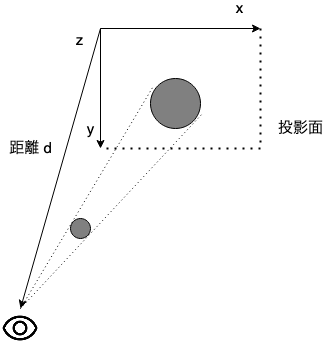
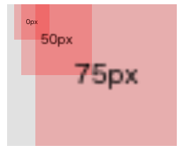
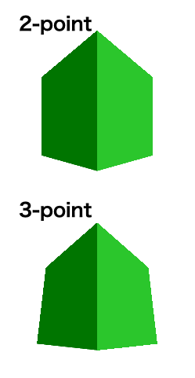

.. post:: 2021-06-26
   :tags: perspective, 3d-image
   :category: CSS

.. meta::
  :description: prespective の調査メモ

==============================
[メモ] css perspective
==============================

目的
=====

三次元画像処理を本格的にはやらないけどある程度は知っておきたいくらいの知識をまとめる

基本知識
=============

css で三次元的な遠近感を表現するには perspective, perspective-origin, transform などのプロパティを用いる。

:perspective: 視点と z=0 の距離
:perspective-origin: 消失点(視点の位置)
:transform: 三次元を含む要素の座標変換

            * 例えば z方向への平行移動は ``translateZ()`` が用いられる

ブラウザはこれらのパラメータから最終的なスクリーンへの描画を行う。このとき、z=0 のxy平面を投影面とした **透視投影 (perspective projection)** が用いられる [1]_

  透視投影の概念図 (消失点が左上に設定された場合)

perspective を指定した要素の子要素は同じ座標空間に配置され、子要素（オブジェクト）のz座標が大きいほど(視点に近づくほど)、大きく描画される。

例
==============

視点から z=0 座標までの距離が 100px の空間上に、一辺 50px の箱を z=0px, z=50px, z=75px の位置にそれぞれ配置し、どのように描画されるかを確認する。

.. literalinclude:: ex1.html
  :language: html

表示結果

* z=0px では 一辺が 50px のまま
* z=50px (視点からの距離は1/2)では、一辺が 100px (2倍) になる
* z=75px (視点からの距離は1/4)では、一辺が 200px (4倍) になる

描画される長さが距離に反比例しているのがわかる  [2]_

perspective プロパティと perspective() の違い
===============================================

perspective プロパティの他、transform に与える perspective() 関数でも視点からの距離を設定できる。

.. code-block :: html

  style="transform: perspective(200px) translateZ(100px);"

* perspective は親要素に指定するが、 perspective() は変換対象に指定する
* perspective() は perspective-origin でなく transform-origin を消失点として変換処理を行う
* perspective() はあくまで３次元座標の変換処理なので、最終的なスクリーンへの描画の際に親要素の perspective (および perspective-origin) の影響を受ける

計算がわけわからなくなるので少なくともどちらか一方を使うのが良いように思える。

perspective プロパティでは視点（カメラ）の傾きがないので、傾きを付けたい場合には親要素に ``transform: perspective() rotateX()`` を指定する、というような使い方だろうか（下の練習ではそのような使い方をしているが、一般的かは不明）。

練習
=====

上の例では立体感がないので、2点パースと3点パースのよくある図を描いてみる

.. literalinclude:: ex2.html
  :language: html

表示結果

その他メモ
============

* ``perspective: none;`` （初期値）の場合は無限遠という扱いなようなので、 z座標が 100 だろうが 10000 だろうが描画される大きさに影響しない、ということらしい

参考
=====

* `CSS Transforms Module Level 2 <https://www.w3.org/TR/css-transforms-2/>`_
* `perspective - CSS: カスケーディングスタイルシート | MDN <https://developer.mozilla.org/ja/docs/Web/CSS/perspective>`_
* `perspective() - CSS: カスケーディングスタイルシート | MDN <https://developer.mozilla.org/ja/docs/Web/CSS/transform-function/perspective()>`_
* `透視投影 - とうしとうえい | 武蔵野美術大学 造形ファイル <http://zokeifile.musabi.ac.jp/%E9%80%8F%E8%A6%96%E6%8A%95%E5%BD%B1/>`_

.. rubric:: Footnotes

.. [1] CSS Transforms Module Level 2 や MDN の解説では z=0 の平面は plane, drawing plane などと表記されているがまぁ projection plane (投影面) ということでよいだろう
.. [2] これは人間の目に近いとされるがより近い描画方法があるのかなどは知らない
